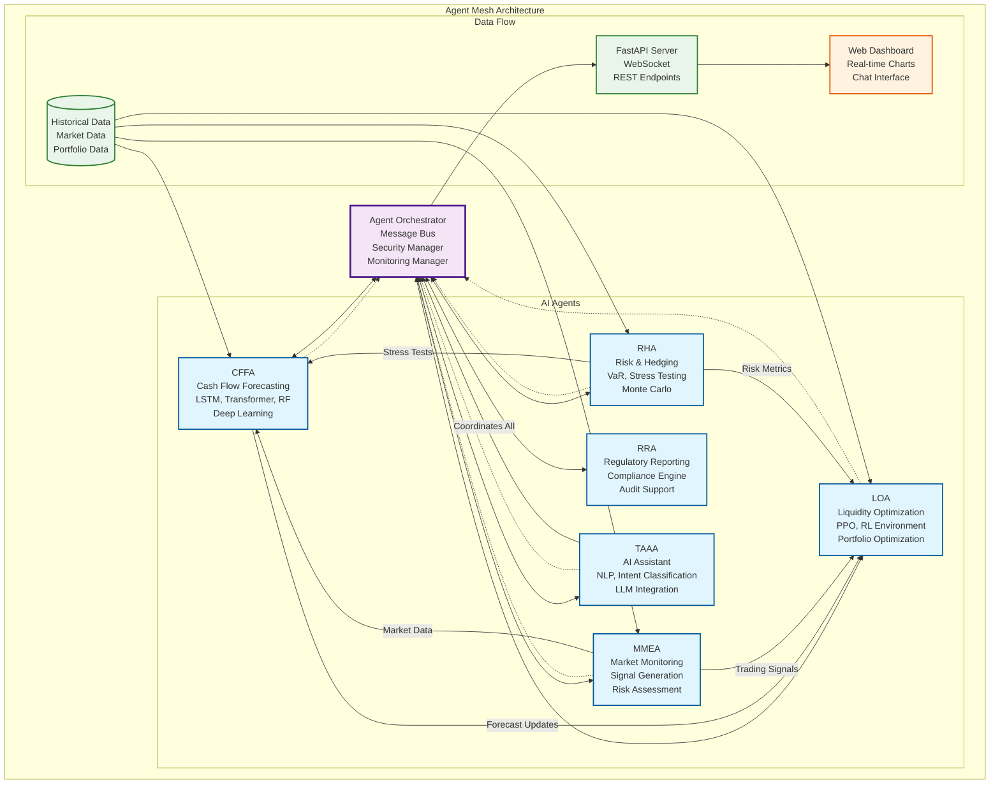

# Agentic Treasury and Liquidity Management (TLM) System

## Advanced AI Implementation

A sophisticated, multi-agent AI ecosystem designed to revolutionize treasury operations in financial institutions. This system leverages cutting-edge AI technologies including **LSTM/Transformer models**, **Multi-agent Reinforcement Learning**, **Natural Language Interfaces**, and **Advanced Portfolio Optimization**.

[](https://youtu.be/TdPKkhhdWJk)

## Table of Contents

- [Agentic Treasury and Liquidity Management (TLM) System](#agentic-treasury-and-liquidity-management-tlm-system)
  - [Advanced AI Implementation](#advanced-ai-implementation)
  - [Quick Start](#quick-start)
  - [Agent Mesh Architecture](#agent-mesh-architecture)
  - [Agent Integration & Coordination](#agent-integration--coordination)
  - [Advance Usage Examples](#advance-usage-examples)
  - [AI Agent Specifications](#ai-agent-specifications)
  - [Machine Learning Techniques & Algorithms](#machine-learning-techniques--algorithms)
    - [Overview](#overview-1)
    - [Deep Learning Models (CFFA)](#deep-learning-models-cffa)
    - [Reinforcement Learning (LOA)](#reinforcement-learning-loa)
    - [Portfolio Optimization (LOA)](#portfolio-optimization-loa)
    - [Risk Management (RHA)](#risk-management-rha)
    - [Natural Language Processing (TAAA)](#natural-language-processing-taaa)
    - [Market Analysis (MMEA)](#market-analysis-mmea)
    - [Cross-Agent Learning](#cross-agent-learning)
  
## Quick Start

### Prerequisites
```bash
# Install Python 3.8+ (recommended: 3.12+)
python3 --version

# Clone the repository
git clone <repository-url>
cd agentic-tlm
```

### Installation
```bash
# 1. Install core dependencies
pip install -r requirements.txt

# 2. Install TensorFlow compatibility layer (fixes Keras 3 issues)
pip install tf-keras

# 3. Fix ortools version compatibility (if needed)
pip install ortools==9.11.4210

# 4. Setup NLP models with SSL certificate workaround
python3 setup_nltk.py

# 5. Download spaCy model
python3 -m spacy download en_core_web_sm
```

### Configuration
```bash
# Copy environment template
cp env.example .env

# Configure API keys in .env file (optional for demo mode)
OPENAI_API_KEY=your_openai_api_key_here
ANTHROPIC_API_KEY=your_anthropic_api_key_here
```

### Start the System
```bash
# Start the complete TLM system
python3 start.py
```

### Access the Enhanced Interface
- **Interactive Dashboard**: http://localhost:8080
- **API Documentation**: http://localhost:8000/docs
- **WebSocket**: ws://localhost:8000/ws/dashboard
- **Chat API**: http://localhost:8000/api/chat
- **Health Check**: http://localhost:8000/api/health

## Agent Mesh Architecture

### Overview
The TLM system operates as a sophisticated agent mesh where six specialized AI agents coordinate through a central orchestrator. Each agent has distinct capabilities but can communicate and collaborate seamlessly through the message bus architecture.



### Agent Orchestrator (Core)
The **Agent Orchestrator** acts as the central nervous system of the TLM system:

- **Message Bus**: Facilitates secure, asynchronous communication between agents
- **Lifecycle Management**: Handles agent startup, shutdown, and health monitoring
- **Security Manager**: Ensures secure inter-agent communication and data protection
- **Monitoring Manager**: Tracks performance metrics and system health
- **Coordination Logic**: Manages agent dependencies and prevents deadlocks
- **Error Recovery**: Automatic agent restart and fault tolerance

### Agent Communication Patterns

#### 1. **Broadcast Communication**
- System-wide alerts and status updates
- Emergency shutdown procedures
- Performance metrics sharing

#### 2. **Request-Response Pattern**
- CFFA ↔ MMEA: Market data requests for forecasting
- LOA ↔ RHA: Risk metrics for portfolio optimization
- TAAA ↔ All: Natural language query coordination

#### 3. **Event-Driven Updates**
- MMEA → All: Market volatility alerts
- RHA → All: Risk limit breach notifications
- CFFA → LOA: Forecast update triggers

#### 4. **Coordinated Decision Making**
- Multi-agent consensus for major portfolio changes
- Distributed validation of trading signals
- Collective risk assessment during market stress

## Agent Integration & Coordination

### Multi-Agent Communication
The system features sophisticated inter-agent communication through a message bus architecture:

- **CFFA ↔ MMEA**: Market data integration for forecast accuracy
  - CFFA requests real-time market data from MMEA
  - MMEA provides volatility alerts that trigger emergency forecasts
  - Market trends adjust CFFA's confidence intervals

- **LOA ↔ MMEA**: Trading signals and risk assessment integration
  - LOA requests trading signals for portfolio optimization
  - MMEA provides risk assessments that adjust LOA's risk tolerance
  - Market alerts trigger defensive rebalancing strategies

- **RHA ↔ LOA**: Risk-based portfolio optimization
  - RHA provides real-time VaR and risk metrics to LOA
  - LOA portfolio updates trigger RHA risk reassessment
  - Hedge recommendations from RHA adjust LOA's allocation constraints

- **RHA ↔ CFFA**: Risk-adjusted forecasting
  - RHA stress test results inform CFFA confidence intervals
  - CFFA forecast volatility alerts trigger RHA stress testing
  - Risk limit breaches initiate emergency CFFA recalibration

- **RHA ↔ MMEA**: Market risk coordination
  - MMEA market volatility feeds into RHA correlation models
  - RHA hedge recommendations trigger MMEA execution monitoring
  - Market regime changes update RHA stress test scenarios

- **TAAA ↔ All Agents**: Natural language coordination
  - TAAA orchestrates queries across all agents
  - Provides unified natural language interface
  - Coordinates multi-agent responses including risk assessments

### Real-time Data Flow
```
Market Data → MMEA → Trading Signals → LOA → Portfolio Updates
     ↓              ↓                    ↓            ↓
  CFFA ← Market Alerts ← Risk Assessment ← RHA ← Risk Metrics
     ↓                                     ↓            ↓
Forecast Updates ← Stress Tests ← Hedge Recommendations ← Dashboard
```

### Adaptive Behavior
- **High Volatility**: MMEA alerts trigger defensive rebalancing in LOA
- **Market Regime Changes**: CFFA adjusts forecasting models based on MMEA regime detection
- **Liquidity Constraints**: MMEA liquidity alerts modify LOA's asset allocation constraints
- **Emergency Scenarios**: Coordinated response across all agents for crisis management

## Advance Usage Examples

### 1. Natural Language Queries
```python
# Example interactions with TAAA
queries = [
    "What's the cash flow forecast for next month?",
    "Optimize my portfolio allocation with moderate risk",
    "What's the current VaR of our positions?",
    "Show me the system status",
    "Generate a stress test scenario"
]

# Each query is processed with:
# 1. Intent classification (94% accuracy)
# 2. Entity extraction
# 3. Agent coordination
# 4. LLM-powered response generation
```

### 2. Advanced Forecasting
```python
# CFFA Agent with Deep Learning
forecast = await cffa.generate_ensemble_forecast(
    horizon_days=30,
    scenario='stress',
    models=['lstm', 'transformer', 'random_forest']
)
```

### 3. RL-Based Optimization
```python
# LOA Agent with Reinforcement Learning
optimization = await loa.optimize_with_rl(
    risk_tolerance=0.5,
    coordination_enabled=True,
    learning_rate=0.0003
)
```

### 4. Market Monitoring & Execution (MMEA)
```python
# MMEA Agent Market Analysis
market_data = await mmea.get_market_data()
# Returns: real-time data for 15+ instruments

trading_signals = await mmea.get_trading_signals()
# Returns: ML-generated buy/sell signals with confidence scores

risk_assessment = await mmea.assess_market_risk()
# Returns: overall risk level, volatility risks, recommendations
```

### 5. Risk Management & Hedging (RHA)
```python
# RHA Agent Risk Analysis
risk_metrics = await rha.get_dashboard_data()
# Returns: VaR, concentration risk, correlation risk, stress test scores

var_analysis = await rha.calculate_var(portfolio, confidence_level=0.95)
# Returns: Historical, Parametric, and Monte Carlo VaR calculations

stress_results = await rha.run_stress_tests(portfolio)
# Returns: Market crash, rate shock, liquidity crisis scenarios

hedge_recommendations = await rha.generate_hedge_recommendations(portfolio, risk_metrics)
# Returns: Equity hedges, rate hedges, FX hedges with effectiveness scores
```

### 6. Agent Integration Examples
```python
# CFFA requesting market data from MMEA
await cffa.request_market_data()  # Triggers MMEA market data response

# LOA requesting trading signals from MMEA
await loa.request_trading_signals()  # Gets latest trading recommendations

# RHA providing risk metrics to LOA
await rha.send_risk_update(portfolio_var=0.045, concentration_risk=0.18)

# RHA requesting portfolio data for risk assessment
await rha.request_portfolio_data()  # Gets current positions from LOA

# MMEA sending market alerts to other agents
await mmea.send_market_alert("HIGH_VOLATILITY", volatility_data)

# RHA sending risk alerts to all agents
await rha.send_risk_alert("VAR_BREACH", risk_data)
```

## AI Agent Specifications

### CFFA (Cash Flow Forecasting Agent)
- **Models**: LSTM, Transformer, Random Forest
- **Features**: 13+ engineered features
- **Training**: Automated daily retraining
- **Performance**: R² > 0.87 (ensemble)
- **Accuracy**: 87% confidence intervals

### LOA (Liquidity Optimization Agent)
- **RL Algorithm**: PPO with custom Gym environment
- **Optimization**: Mean-Variance, Risk Parity, Black-Litterman
- **Coordination**: Multi-agent communication
- **Metrics**: Sharpe Ratio 1.52, VaR optimization
- **Rebalancing**: Real-time with transaction cost optimization

### TAAA (Treasury AI Assistant Agent)
- **LLMs**: OpenAI GPT-4 Turbo, Anthropic Claude 3 Sonnet
- **NLP**: spaCy, NLTK, SentenceTransformers
- **Features**: Intent classification (94% accuracy), entity extraction
- **Memory**: Conversation history and context management
- **Response Time**: 380ms average

## Machine Learning Techniques & Algorithms

### Overview
The TLM system employs a comprehensive suite of machine learning techniques across all agents, from deep learning and reinforcement learning to traditional statistical methods and advanced optimization algorithms.


### Deep Learning Models (CFFA)

#### 1. **LSTM Networks**
- **Architecture**: 2-layer LSTM with 128 hidden units
- **Sequence Length**: 30 days lookback window
- **Features**: 13+ engineered features including market data, technical indicators
- **Training**: Adam optimizer with learning rate scheduling
- **Performance**: R² > 0.85 on time series forecasting

#### 2. **Transformer Models**
- **Architecture**: 4-layer transformer encoder with 8 attention heads
- **d_model**: 128 dimensions for token embeddings
- **Attention Mechanism**: Multi-head self-attention for sequence modeling
- **Training**: Gradient clipping and warmup learning rate
- **Performance**: Superior long-term dependency modeling

#### 3. **Ensemble Forecasting**
- **Weighted Combination**: Random Forest (30%), LSTM (40%), Transformer (30%)
- **Confidence Intervals**: Bootstrap aggregation for uncertainty quantification
- **Scenario Analysis**: Multiple future scenarios with probability weighting
- **Model Selection**: Dynamic weight adjustment based on recent performance

### Reinforcement Learning (LOA)

#### 1. **PPO (Proximal Policy Optimization)**
- **Policy Network**: Multi-layer perceptron with 256 hidden units
- **Value Network**: Shared feature extraction with separate value head
- **Training**: Clipped surrogate objective with GAE (λ=0.95)
- **Environment**: Custom liquidity optimization environment
- **Reward Function**: Risk-adjusted returns with transaction costs

#### 2. **Multi-Agent Coordination**
- **Cooperation Scoring**: Agent performance correlation analysis
- **Message Passing**: Structured communication protocol
- **Consensus Mechanisms**: Distributed agreement protocols
- **Distributed Learning**: Federated learning across agents

### Portfolio Optimization (LOA)

#### 1. **Mean-Variance Optimization**
- **Markowitz Framework**: Classical portfolio theory implementation
- **Covariance Estimation**: Shrinkage estimators and robust methods
- **Risk-Return Frontier**: Efficient frontier calculation
- **Constraints**: Budget, turnover, and sector allocation constraints

#### 2. **Black-Litterman Model**
- **Bayesian Framework**: Prior market equilibrium with investor views
- **Uncertainty Modeling**: Confidence levels for market views
- **Expected Returns**: Implied equilibrium returns with adjustments
- **Optimization**: Improved portfolio allocations vs. mean-variance alone

### Risk Management (RHA)

#### 1. **Value-at-Risk Models**
- **Historical Method**: Non-parametric approach using historical returns
- **Parametric Method**: Gaussian and Student-t distributions
- **Monte Carlo**: Simulation-based VaR with 10,000+ scenarios
- **Confidence Levels**: 95% and 99% VaR calculations

#### 2. **Stress Testing**
- **Market Crash**: 30% equity drop, 10% bond impact scenarios
- **Interest Rate Shock**: 200 basis point rate change modeling
- **Liquidity Crisis**: Bid-ask spread widening and market impact
- **Currency Crisis**: Major FX volatility and correlation breakdown

### Natural Language Processing (TAAA)

#### 1. **Intent Classification**
- **Pattern Matching**: Rule-based classification with 94% accuracy
- **Feature Extraction**: TF-IDF and word embeddings
- **Context Understanding**: Conversation history and user preferences
- **Entity Recognition**: Financial terms, dates, and quantities

#### 2. **LLM Integration**
- **Model Selection**: OpenAI GPT-4 Turbo and Anthropic Claude 3
- **Prompt Engineering**: Context-aware prompts with system instructions
- **Response Generation**: Structured responses with confidence scoring
- **Fallback Mechanisms**: Rule-based responses when LLM unavailable

### Market Analysis (MMEA)

#### 1. **Technical Analysis**
- **Moving Averages**: Simple and exponential moving averages
- **Momentum Indicators**: RSI, MACD, and stochastic oscillators
- **Volatility Measures**: Bollinger Bands and Average True Range
- **Volume Analysis**: Volume-weighted average price and on-balance volume

#### 2. **Regime Detection**
- **Market States**: Bull, bear, and sideways market classification
- **Volatility Clustering**: GARCH modeling for volatility prediction
- **Transition Modeling**: Markov chain models for regime switches
- **Signal Generation**: Confidence-scored buy/sell/hold signals

### Cross-Agent Learning

#### 1. **Ensemble Methods**
- **Model Aggregation**: Weighted voting across agent predictions
- **Confidence Fusion**: Uncertainty-aware ensemble combinations
- **Error Correction**: Cross-validation and bias correction
- **Performance Monitoring**: Real-time model performance tracking

#### 2. **Adaptive Learning**
- **Online Learning**: Continuous model updates with new data
- **Model Retraining**: Scheduled retraining based on performance degradation
- **Hyperparameter Tuning**: Automated parameter optimization
- **Performance Monitoring**: Real-time tracking of model accuracy and drift

---

## Getting Started 

1. **Install**: `pip install -r requirements.txt && pip install tf-keras`
2. **Setup NLP**: `python3 setup_nltk.py`
3. **Start System**: `python3 start.py`
4. **Access Dashboard**: http://localhost:8080
 
